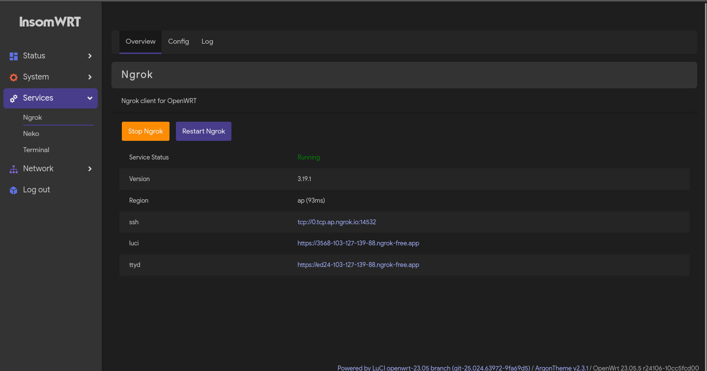
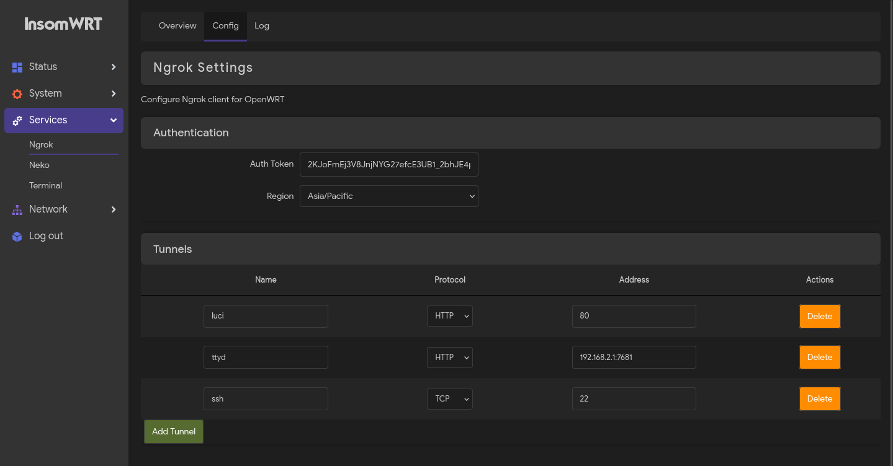
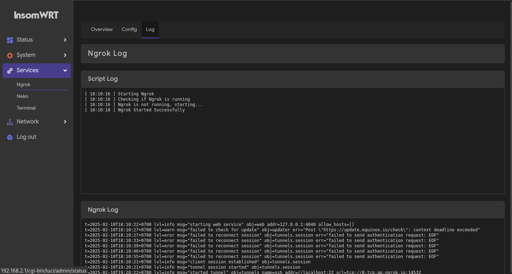

## NGROK FOR OPENWRT

Aplikasi ini dibuat untuk control openwrt jarak jauh, Agar bisa memantau trafik internet, dan untuk configuasi lain nya.

### FITUR
- [x] Configurasi config ngrok di luci
- [x] Multi tunnel
- [x] Support http tcp untuk remote ssh ataupun web
- [x] Multi region bisa di pilih di luci
- [x] Hapus dan menambahkan tunnel di luci
- [x] Di overview menampilkan link dan ping untuk mempermudah penggunaaan
- [x] Dan mampilkan log ngrok di luci.

### INSTALL

### SCREENSHOT

Overview

Config

Logs

### SPECIAL THANKS
- ALLAH SWT
- DBAI
- INDOWRT

### CREDIT
- [ngrok](https://ngrok.com/)
- [openwrt](https://openwrt.org/)
- [luci](https://github.com/openwrt/luci)
- [ngrok-openwrt](https://github.com/BobbyUnknown/ngrok-openwrt)